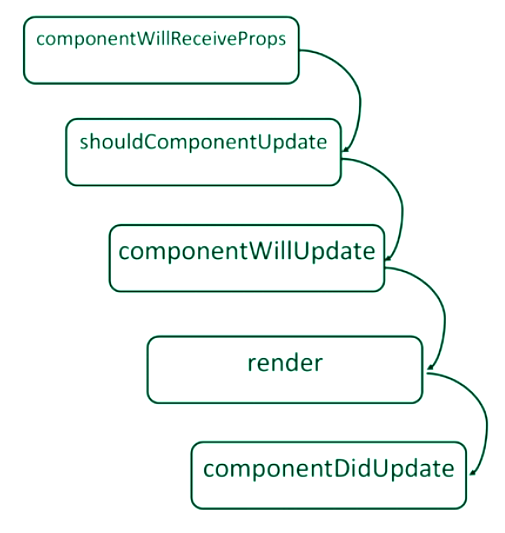
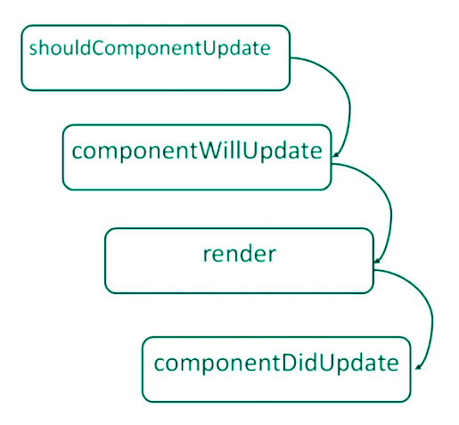

`Basically all the React component’s lifecyle methods can be split in four phases: initialization, mounting, updating and unmounting. Let’s take a closer look at each one of them.`

`Each component has several “lifecycle methods” that you can use to run code at particular times in the process. Methods prefixed with will are called right before something happens, and methods prefixed with did are called right after something happens.`

## Mounting
 1. constructor()
 2. componentWillMount()
 3. render()
 4. componentDidMount()

## Updating
 1. componentWillReceiveProps()
 2. shouldComponentUpdate()
 3. componentWillUpdate()
 4. render()
 5. componentDidUpdate()

## Unmounting
 1. componentWillUnmount()

## THE MOST USEFUL ARE:

1. render() to display props and state as a single React element using jsx
2. constructor() where we define the initial state of the component.
3. componentDidMount() which is called after the component renders for the first time. It is the best place to fetch some data from an api.

4. componentWillReceiveProps() where we receive props from a parent component and we can do all the conditional operations that are related to new props being received.

5. componentDidUpdate(prevProps, prevState) here we can compare the current props/state to previous props/state, so it is the place you hook into when listening to props changes.

### Mounting
Mounting is the process that ocurs when a component is being inserted into the DOM. This phase has tow methods:

1. ComponentWillMount(): `This method is the first called in this phase. It's invoked once and immediately before the initial rendering occurs, before React inserts the component into the DOM.`
2. Component Did Mount(): `This is second invoked in this phase, just once and immediately after React inserts the component into the DOM. Now the updated DOM is available for access, which means that this method is the best place for initializing other Javascript libraries that need access to the DOM and for data fetching operations.`

## Updating
`There are also methods that will allow us to execute code relative to when a component's state or properties get updated.These methods are part of the updating phase and are called in the following order:`

1. When receiving new props from the parent:

2. When the state changes via this.setState()'

`During this phase a React Component is already inserted into the DOM. Thus these methods are not called for the first render().`

`The first one is componentWillReceiveProps(),invoked when a component id receiving new props.Use this method as an opportunity to react to a prop transition before the render() method is called.`

`The shouldComponentUpdate() method allows us to decide whethe the next component's state should trigger a re-render or not.This method returns a boolean value, which by default is true. It can return false and the next methods won't be called.`

1. componentWillUpdate(): `The componentWillUpdate() method id called immediately before rendering, when new props or state are being received. It can perform preparation before an updates occurs, however is not allowed to use this.setState().`

2. render()

3. componentDidUpdate(): `The componentDidUpdate() method is called immediately after React updates the DOM. This method use to interact with the updated DOM or perform any action post-render. This method gets two arguments:`
    1. prevProps: the previous properties object.
    2. prevState: the previous state object.
`A common use for this method is when using a third-party library that needs the rendered DOM to perform its job- e.g. a jQuery plugin.`

## UNMOUNTING
 -componentWillUnmount()

 `It is called immediately before the component is unmounted from the DOM.It use to perform any cleanup,such as invalidating timers or cleaning up any DOM elements.`
